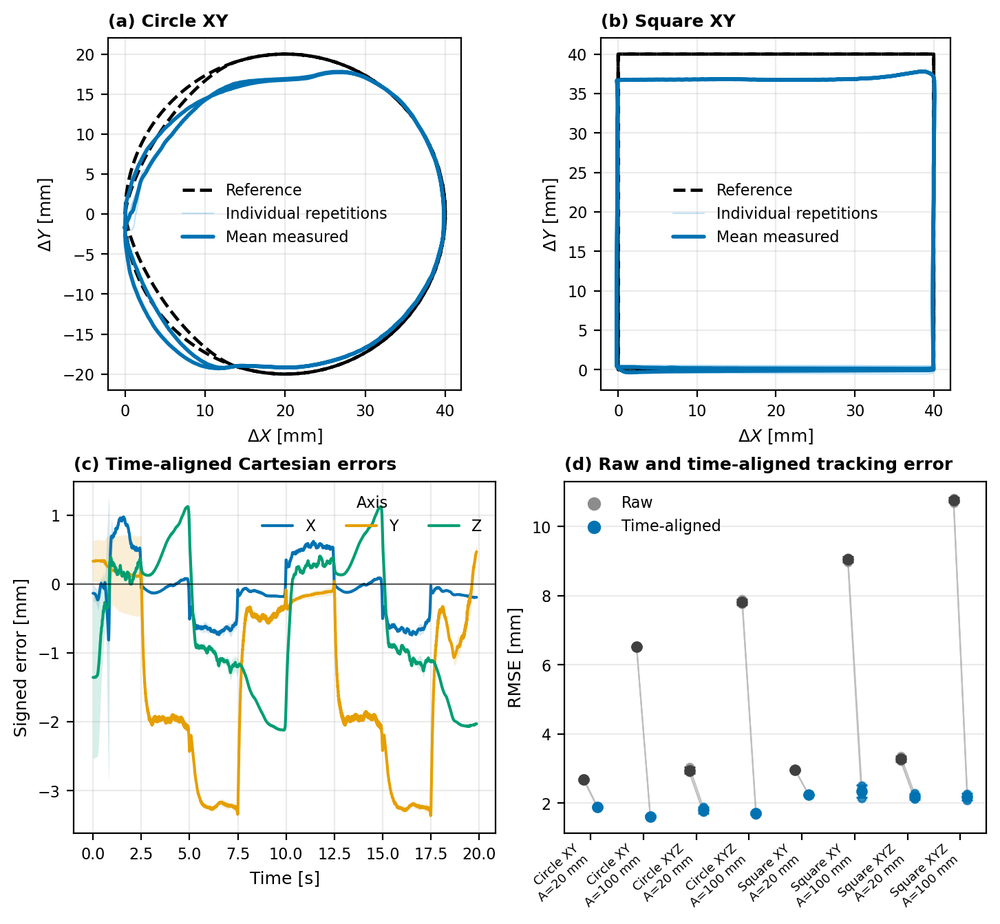

# Time-Aligned Cartesian Tracking Results

## Method

For each repetition, one non-negative three-dimensional time shift was selected by minimizing the mean squared Euclidean distance between the Cartesian reference and the interpolated measured trajectory:

$$
\tau^* = \arg\min_{0 \leq \tau \leq 0.5\,\mathrm{s}} \frac{1}{N}\sum_t \|\mathbf{p}_{meas}(t+\tau)-\mathbf{p}_{ref}(t)\|_2^2.
$$

The same lag was applied to X, Y, and Z. No axis-specific optimization was used. This fitted offset is an effective trajectory-tracking lag that combines target filtering, step limiting, and robot dynamics; it is not a measurement of UDP or command-to-motion latency. Metrics were first computed for each independent repetition and then summarized as mean ± sample standard deviation across repetitions. The complete recorded interval was analyzed; no samples were removed based on warmup or trajectory closing.

## Main tracking results

| Trajectory | Amplitude [m] | Nominal max speed [mm/s] | Repetitions | Raw mean error [mm] | Aligned mean error [mm] | Aligned RMSE [mm] | Aligned P95 [mm] | Lag [ms] |
|---|---:|---:|---:|---:|---:|---:|---:|---:|
| circle_xy | 0.02 | 12.6 | 3 | 2.46 ± 0.05 | 1.71 ± 0.03 | 1.89 ± 0.02 | 3.15 ± 0.01 | 150.0 ± 0.0 |
| circle_xy | 0.1 | 62.8 | 3 | 6.29 ± 0.03 | 1.47 ± 0.02 | 1.61 ± 0.02 | 2.80 ± 0.17 | 100.0 ± 0.0 |
| circle_xyz | 0.02 | 17.8 | 3 | 2.75 ± 0.02 | 1.56 ± 0.02 | 1.80 ± 0.08 | 3.14 ± 0.03 | 150.0 ± 0.0 |
| circle_xyz | 0.1 | 88.9 | 3 | 7.65 ± 0.06 | 1.51 ± 0.05 | 1.71 ± 0.04 | 2.94 ± 0.23 | 100.0 ± 0.0 |
| square_xy | 0.02 | 16.0 | 3 | 2.80 ± 0.01 | 2.02 ± 0.02 | 2.23 ± 0.01 | 3.49 ± 0.03 | 120.0 ± 0.0 |
| square_xy | 0.1 | 80.0 | 3 | 8.69 ± 0.07 | 2.15 ± 0.16 | 2.35 ± 0.18 | 3.98 ± 0.42 | 110.0 ± 0.0 |
| square_xyz | 0.02 | 20.3 | 3 | 3.11 ± 0.04 | 1.94 ± 0.07 | 2.19 ± 0.08 | 3.60 ± 0.14 | 130.0 ± 0.0 |
| square_xyz | 0.1 | 101.7 | 3 | 10.35 ± 0.08 | 2.00 ± 0.11 | 2.18 ± 0.09 | 3.47 ± 0.26 | 110.0 ± 0.0 |

## Axis-wise aligned errors

Bias is the signed mean error. RMSE is reported independently for each Cartesian axis.

| Trajectory | Amplitude [m] | Bias X/Y/Z [mm] | RMSE X/Y/Z [mm] |
|---|---:|---:|---:|
| circle_xy | 0.02 | -0.12 / -1.06 / -0.47 | 0.61 / 1.53 / 0.92 |
| circle_xy | 0.1 | -0.21 / -0.88 / -0.07 | 0.75 / 1.28 / 0.64 |
| circle_xyz | 0.02 | -0.15 / -1.08 / -0.52 | 0.46 / 1.52 / 0.84 |
| circle_xyz | 0.1 | -0.19 / -0.85 / -0.38 | 0.84 / 1.30 / 0.71 |
| square_xy | 0.02 | -0.09 / -1.40 / -0.53 | 0.44 / 1.89 / 1.11 |
| square_xy | 0.1 | -0.01 / -1.51 / 0.04 | 0.85 / 1.97 / 0.95 |
| square_xyz | 0.02 | -0.06 / -1.44 / -0.43 | 0.47 / 1.89 / 0.99 |
| square_xyz | 0.1 | -0.05 / -1.30 / 0.11 | 0.65 / 1.90 / 0.87 |

## Recommended presentation in the paper

Use one compact tracking figure in the main paper:

1. Reference and measured circle in the XY plane.
2. Reference and measured square in the XY plane.
3. Signed X, Y, and Z errors after applying the common time shift.
4. A summary plot of aligned RMSE across trajectory types and amplitudes, with repetitions shown as individual points and mean ± SD overlaid.

Use a black dashed line for the reference and a solid color-blind-safe line for measured motion. Keep all labels in English, use millimetres for tracking errors, preserve equal aspect ratio for path plots, and export the final artwork as PDF or SVG.

Suggested caption:

> **Cartesian tracking after temporal alignment.** Reference and measured end-effector paths for circular and square trajectories. A single three-dimensional lag was estimated independently for each repetition and applied equally to all Cartesian axes. Signed axis errors show residual geometric and static tracking error after delay compensation. Reported statistics are mean ± SD across independent repetitions.

## Generated article figure

Generate the compact four-panel figure after running the alignment script:

```bash
python scripts/plot_article_tracking.py --aligned trajectory_analysis/aligned --metrics trajectory_analysis/metrics_per_run.csv --output trajectory_analysis/article_tracking --amplitude 0.02 --frequency 0.1 --formats pdf png
```

- Vector artwork: [`article_tracking.pdf`](article_tracking.pdf)
- Markdown preview: 
- Supplementary description: [`article_tracking.txt`](article_tracking.txt)

## Files for reproducibility

- Per-run metrics: [`metrics_per_run.csv`](metrics_per_run.csv)
- Time-aligned trajectories: [`aligned/`](aligned/)
- Each aligned CSV contains the reference timestamp, corresponding shifted measurement timestamp, common lag, target position, interpolated measured position, and aligned error norm.

## Reporting notes

- State trajectory amplitude, geometric size, nominal speed, frequency, duration, and number of independent repetitions in the paper.
- Report both raw and time-aligned errors; the difference quantifies the contribution of delay.
- Do not treat sampled control points as independent repetitions.
- Keep the detailed per-condition plots in the supplementary material.
- Ensure that the abstract and conclusion use the values from the final repeated experiment set.
